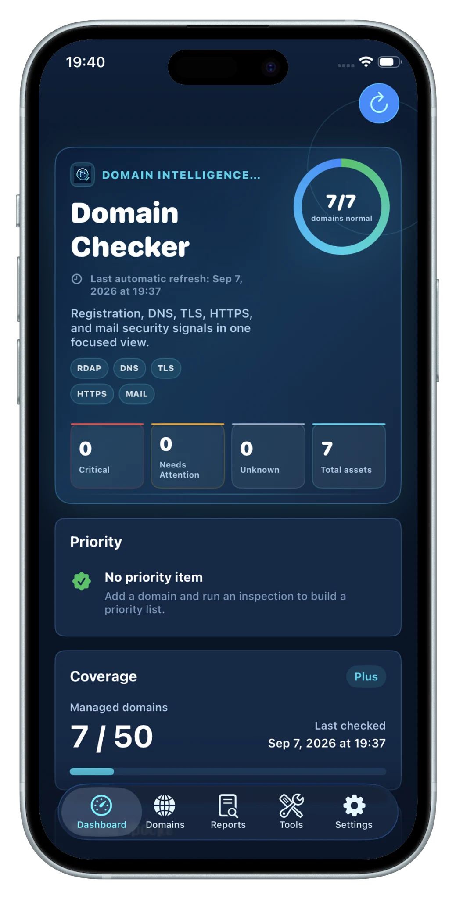

# Domain Checker: DNS & SSL

**Domain, DNS, HTTPS/TLS, and mail health in one focused app.**  
**把域名、DNS、HTTPS/TLS 与邮件安全检查集中到一个 App。**

A local-first iPhone and iPad app for checking domain registration and expiry, DNS records, HTTP/HTTPS reachability, TLS certificates, and public mail-security configuration.

一款本地优先的 iPhone 与 iPad 域名检查应用，用于查看域名注册与到期、DNS 记录、HTTP/HTTPS 可达性、TLS 证书以及公开邮件安全配置。

 

 

  

 

[English](#english) · [简体中文](#简体中文) · [Website](https://domain.opshome.run) · [Privacy](https://domain.opshome.run/privacy/) · [Support](https://domain.opshome.run/support/) · [App Store](https://apps.apple.com/us/app/domain-checker-dns-ssl/id6792293532)

---

## English

### Overview

**Domain Checker: DNS & SSL** brings domain registration, expiry, DNS, HTTP/HTTPS, TLS, and mail-security checks into one focused iPhone and iPad app.

It is designed for people who manage personal websites, APIs, home services, mail domains, parked domains, and small portfolios of internet-facing assets. Instead of switching between multiple lookup sites and command-line tools, you can keep a domain inventory, run structured checks, review health states, and export results when needed.

### Core capabilities

| Capability | What it does |
| --- | --- |
| **Domain registration & expiry** | Reviews public RDAP registration data, domain status, expiry date, remaining days, name servers, and registrar information when available. |
| **DNS inspection** | Groups public records such as A, AAAA, CNAME, NS, MX, TXT, SOA, CAA, SPF-related TXT, DKIM-related records, and DMARC. |
| **HTTP / HTTPS checks** | Tests reachability, response status, redirects, headers, and selected service ports. |
| **TLS inspection** | Reviews handshake status, certificate validity, issuer, subject, expiry, SANs, fingerprint, and related warnings. |
| **Custom ports** | Supports HTTPS/TLS services that do not use only the default port 443. |
| **Mail-security checks** | Reviews public MX, SPF, DKIM, DMARC, and supporting TXT configuration. |
| **Usage profiles** | Organizes checks around websites, APIs, mail domains, home services, parked domains, and other scenarios. |
| **Structured health reports** | Separates normal, needs-attention, disabled, and not-configured states instead of collapsing everything into one generic score. |
| **Bulk import / export** | Helps move or maintain larger domain inventories without re-entering domains one by one. |
| **JSON backup & restore** | Preserves the local domain list, settings, and related data for migration and recovery. |
| **PDF report export** | Creates readable reports for documentation, review, and sharing. |

### Workflow

1. **Add or bulk import domains** — paste a domain, URL, explicit service port, or import an existing list.
2. **Choose the intended use** — website, API, mail, home service, parked domain, or another suitable profile.
3. **Run inspection** — the app queries the public endpoints needed for the selected checks.
4. **Review the health report** — inspect registration, DNS, HTTP, TLS, and mail findings by category.
5. **Export, back up, or restore** — create PDF reports or preserve/move the local domain inventory with JSON backup and restore.

### Health states

| State | Meaning |
| --- | --- |
| **Normal** | The check completed and the result appears consistent with the selected use case. |
| **Needs attention** | The result may require review, correction, or renewal planning. |
| **Disabled** | Inspection for the domain or check has been intentionally paused. |
| **Not configured** | The related record or service was not detected or is not configured. |

### Typical issues it can surface

- Domains approaching expiry
- Missing or unexpected DNS records
- Incorrect A, AAAA, CNAME, NS, or MX configuration
- Unreachable HTTPS services
- Unexpected HTTP responses or redirect behavior
- TLS handshake failures
- Certificates approaching expiry
- Missing or incomplete SPF, DKIM, or DMARC configuration
- Checks that are intentionally disabled or not configured

Domain Checker: DNS & SSL reports public inspection results. It does not automatically edit DNS, renew certificates, or modify registrar settings.

### Pricing & plans

Core diagnostics remain available across all tiers. **Plus**, **Pro**, and **Unlimited** are non-consumable in-app purchases: one payment, permanent unlock, with no monthly or annual subscription.

| Plan | U.S. price | Domain allowance | Saved report history | Best for |
| --- | ---: | ---: | ---: | --- |
| **Free** | $0 | 10 included | 3 | Personal sites and smaller domain lists |
| **Plus** | $3.99 one-time | +50 domains | 20 | Multi-site owners and independent developers |
| **Pro** | $8.99 one-time | +100 domains | 100 | Larger portfolios and professional workflows |
| **Unlimited** | $19.99 one-time | Unlimited saved domains | 100 | Heavy users and large domain portfolios |

Domain allowances are cumulative for the fixed-quantity purchases: **Free 10 + Plus 50 + Pro 100 = up to 160 saved domains** when both Plus and Pro are owned. **Unlimited** removes the saved-domain count limit instead of adding another numeric allowance.

All tiers include core DNS, HTTPS/TLS, and domain diagnostics. Free includes basic bulk import/export; paid tiers unlock the full bulk workflow. PDF report export and local-first storage remain available across the plans shown on the current website.

> Prices above reflect the U.S. App Store presentation configured for the current product. Local App Store pricing may vary by country or region.

### Local-first privacy

The app is designed around a local-first data model. Domain names, URLs, custom service ports, usage profiles, inspection settings, report findings, report history, entitlement state, language preference, and backup metadata may be stored locally on the device.

When an inspection runs, the app connects to the public DNS, RDAP, HTTP, HTTPS, TLS, and mail-related endpoints required to create the report.

The app does **not** require registrar passwords, DNS-provider credentials, certificate private keys, server passwords, or packet capture for normal use. It also does not require a Domain Checker cloud account to maintain the local domain inventory.

See the full [Privacy Policy](https://domain.opshome.run/privacy/).

### Related OpsHome products

Domain Checker: DNS & SSL focuses on domain diagnostics and report generation. For continuous uptime monitoring, private infrastructure visibility, Docker Probe checks, Synology, Proxmox, VMware, Linux hosts, incidents, alerts, history, and Web Console access, see **OpsHome NOC**.

[Explore OpsHome NOC](https://app.opshome.run)

### App Store

[Download Domain Checker: DNS & SSL](https://apps.apple.com/us/app/domain-checker-dns-ssl/id6792293532)

### Support

For product support:

- Visit the [support page](https://domain.opshome.run/support/)
- Include the app version, iOS/iPadOS version, device model, affected domain, expected result, and actual result when relevant
- Do not send registrar passwords, DNS-provider credentials, certificate private keys, server passwords, or other secrets

---

## 简体中文

### 产品介绍

**Domain Checker: DNS & SSL** 将域名注册与到期、DNS、HTTP/HTTPS、TLS 证书以及邮件安全检查集中到一款专注的 iPhone 与 iPad 应用中。

它适合管理个人网站、API、家庭服务、邮件域名、停放域名以及中小规模公网资产。你可以维护域名清单、运行结构化检查、查看健康状态，并在需要时导出报告，而不必反复打开多个查询网站或命令行工具。

### 核心能力

| 能力 | 说明 |
| --- | --- |
| **域名注册与到期** | 查看公开 RDAP 注册数据、域名状态、到期时间、剩余天数、名称服务器，以及可获取时的注册商信息。 |
| **DNS 检查** | 按类型查看 A、AAAA、CNAME、NS、MX、TXT、SOA、CAA、SPF、DKIM、DMARC 等公开记录。 |
| **HTTP / HTTPS 检查** | 检查可达性、响应状态、跳转、响应头以及指定服务端口。 |
| **TLS 检查** | 查看 TLS 握手、证书有效性、颁发者、主题、到期时间、SAN、指纹及相关警告。 |
| **自定义端口** | 支持不只运行在默认 443 端口上的 HTTPS/TLS 服务。 |
| **邮件安全检查** | 查看公开 MX、SPF、DKIM、DMARC 及相关 TXT 配置。 |
| **用途配置** | 根据网站、API、邮件、家庭服务、停放域名等实际用途组织检查。 |
| **结构化健康报告** | 使用正常、需要关注、已禁用、尚未配置等状态，而不是简单压缩成一个通用分数。 |
| **批量导入 / 导出** | 便于维护和迁移较大的域名资产清单。 |
| **JSON 备份与恢复** | 用于设备迁移、恢复域名清单和相关本地数据。 |
| **PDF 报告导出** | 生成适合归档、审阅和分享的可读报告。 |

### 使用流程

1. **添加或批量导入域名** —— 粘贴域名、URL、明确的服务端口，或导入已有域名清单。
2. **选择实际用途** —— 网站、API、邮件、家庭服务、停放域名或其他合适场景。
3. **运行检查** —— 应用查询当前检查所需的公开端点。
4. **查看健康报告** —— 按注册信息、DNS、HTTP、TLS 和邮件分类查看结果。
5. **导出、备份与恢复** —— 生成 PDF 报告，或通过 JSON 备份与恢复保存、迁移域名资产清单。

### 健康状态

| 状态 | 含义 |
| --- | --- |
| **正常** | 检查完成，结果与当前用途基本一致。 |
| **需要关注** | 结果可能需要进一步核实、修正或安排续期。 |
| **已禁用** | 当前域名或检查项目已主动暂停。 |
| **尚未配置** | 未检测到相关记录或服务，或者尚未进行配置。 |

### 常见可发现问题

- 域名接近到期
- DNS 记录缺失或异常
- A、AAAA、CNAME、NS 或 MX 配置错误
- HTTPS 服务无法访问
- HTTP 响应或跳转异常
- TLS 握手失败
- 证书接近到期
- SPF、DKIM 或 DMARC 配置缺失或不完整
- 已主动禁用或尚未配置的检查项目

应用负责检查和展示公开结果，不会自动修改 DNS、续期证书或更改注册商设置。

### 定价与方案

核心域名诊断能力在各档位均可使用。**Plus**、**Pro** 与 **Unlimited** 均为非消耗型应用内购买：一次付费，永久解锁，不收月费或年费。

| 方案 | 美国区价格 | 域名额度 | 报告历史 | 适合 |
| --- | ---: | ---: | ---: | --- |
| **Free** | $0 | 含 10 个 | 3 | 个人站点和较小规模域名清单 |
| **Plus** | $3.99 一次性 | +50 个 | 20 | 多站点用户和独立开发者 |
| **Pro** | $8.99 一次性 | +100 个 | 100 | 更大的域名资产组合和专业工作流 |
| **Unlimited** | $19.99 一次性 | 保存域名数量不限 | 100 | 重度用户和大型域名资产组合 |

固定数量档位采用叠加逻辑：同时拥有 Plus 与 Pro 时，**Free 10 + Plus 50 + Pro 100 = 最多 160 个保存域名**。**Unlimited** 则直接取消保存域名数量限制，不再继续叠加一个数值额度。

各档位均包含核心 DNS、HTTPS/TLS 与域名诊断。Free 提供基础批量导入/导出，付费档位提供完整批量工作流。PDF 报告导出和本地优先存储继续覆盖当前产品方案。

> 以上价格对应当前产品配置的美国区 App Store 价格，不同国家或地区的实际售价可能不同。

### 本地优先隐私设计

应用采用本地优先的数据模型。域名、URL、自定义服务端口、用途配置、检查设置、报告结果、报告历史、购买权益状态、语言偏好和备份元数据可能保存在设备本地。

执行检查时，应用会连接生成报告所需的公开 DNS、RDAP、HTTP、HTTPS、TLS 和邮件相关端点。

正常使用不需要注册商密码、DNS 服务商凭据、证书私钥、服务器密码或网络抓包，也不要求注册 Domain Checker 云端账号来维护本地域名资产清单。

查看完整的[隐私政策](https://domain.opshome.run/privacy/)。

### OpsHome 产品矩阵

Domain Checker: DNS & SSL 专注于域名诊断和报告生成。如需持续可用性监控、私有基础设施可视化、Docker Probe、Synology、Proxmox、VMware、Linux 主机、Incidents、告警、历史记录以及 Web Console，请使用 **OpsHome NOC**。

[了解 OpsHome NOC](https://app.opshome.run)

### App Store

[在 App Store 下载 Domain Checker: DNS & SSL](https://apps.apple.com/us/app/domain-checker-dns-ssl/id6792293532)

### 支持

需要产品支持时：

- 访问 [Domain Checker 支持页面](https://domain.opshome.run/support/)
- 如问题与检查结果有关，请提供应用版本、iOS/iPadOS 版本、设备型号、受影响域名、预期结果和实际结果
- 请勿发送注册商密码、DNS 服务商凭据、证书私钥、服务器密码或其他敏感信息

---

**Focused domain checks. Local-first reports. Clear next steps.**  
**专注域名检查。本地优先报告。清晰定位问题。**

[Website](https://domain.opshome.run) · [App Store](https://apps.apple.com/us/app/domain-checker-dns-ssl/id6792293532) · [Privacy](https://domain.opshome.run/privacy/) · [Support](https://domain.opshome.run/support/)

 

© 2026 OpsHome™. All rights reserved.

